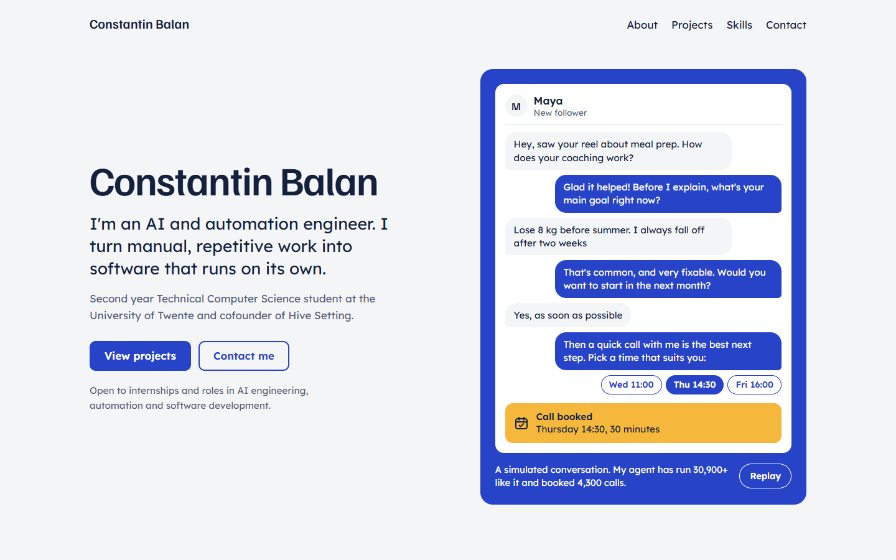

# balanconstantin.com

My personal website: who I am, what I've built, and how to reach me.
Live at [balanconstantin.com](https://balanconstantin.com)

## Built with
Plain HTML, CSS and JavaScript. No framework and no build step.

## Structure
- `index.html`: page layout
- `styles.css`: design and responsive layout
- `main.js`: renders the sections and plays the hero chat
- `content.js`: all editable content (projects, experience, skills, links)
- `assets/`: images and CV

## Add a project
1. Open `content.js`.
2. Copy an existing project entry and change the title, description, tags and links.
3. Links only show when they are filled in.

## Run locally
Open `index.html` in a browser.

## Deployment
Hosted on Cloudflare Pages. Every push to `main` updates the live site.